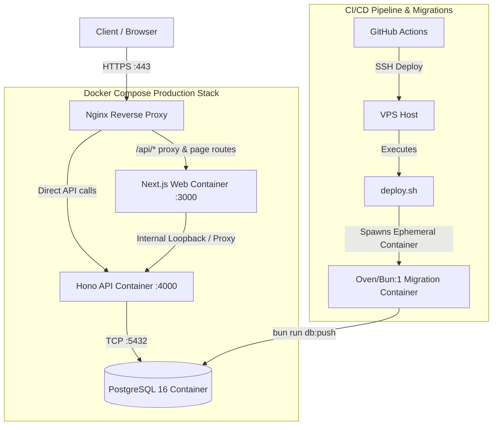
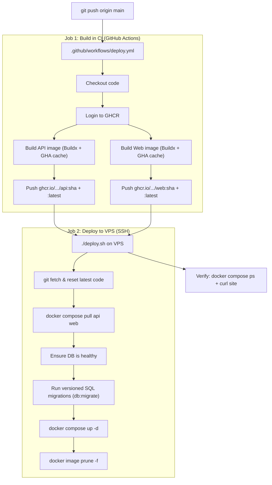

# Project Overview: Traveny Monorepo & Deployment Architecture

Welcome to the **Traveny** engineering overview. This document serves as the comprehensive architectural reference for our monorepo-based SaaS application, designed for high performance, end-to-end type safety, and robust containerized deployment on Linux VPS infrastructure.



---

## 🚀 Tech Stack & Core Technologies

- **Runtime & Package Manager:** [Bun](https://bun.sh/) — Powers our workspace management, fast dependency installation, bundling, and high-performance runtime execution.
- **Frontend Layer:** [Next.js 15+](https://nextjs.org/) — Utilizing the App Router, optimized standalone builds, and dynamic backend proxying.
- **Backend API Layer:** [Hono](https://hono.dev/) — Ultra-fast web framework leveraging Zod-OpenAPI for type-safe routing, OpenAPI spec generation, and RPC client capabilities.
- **Authentication:** [Better Auth](https://www.better-auth.com/) — Modular authentication engine integrated seamlessly across Hono (backend API) and Next.js (frontend client & middleware).
- **Database & ORM:** [Drizzle ORM](https://orm.drizzle.team/) & PostgreSQL 16 — Type-safe schema definitions, migrations, and high-performance query execution.
- **Validation & Typing:** [Zod](https://zod.dev/) & TypeScript — Strict runtime validation and compile-time contract enforcement across apps.

---

## 📂 Monorepo Project Structure

Our codebase uses Bun Workspaces to cleanly separate application entry points from shared core logic.

```
traveny/
├── apps/
│   ├── api/                  # Backend service (Hono / Bun)
│   │   ├── src/
│   │   │   ├── lib/          # Backend setup, OpenAPI config, CORS logic
│   │   │   ├── middlewares/  # Authentication & Admin authorization guards
│   │   │   ├── routes/       # Endpoint definitions (Users, Auth, etc.)
│   │   │   └── types/        # Context and binding definitions
│   │   ├── server.ts         # Production server entry point
│   │   └── Dockerfile        # Multi-stage build for API standalone bundle
│   │
│   └── web/                  # Frontend web application (Next.js 15+)
│       ├── src/
│       │   ├── app/          # Next.js App Router pages & API catch-all proxy
│       │   ├── components/   # Shared UI components (Shadcn/UI, layout elements)
│       │   ├── lib/          # Frontend utilities, authClient, Hono RPC client
│       │   └── modules/      # Feature-scoped logic (Auth forms, Zod schemas)
│       ├── middleware.ts     # Route protection & session validation middleware
│       └── Dockerfile        # Multi-stage build for Next.js standalone server
│
├── packages/
│   └── core/                 # Shared domain logic & system configurations
│       ├── src/
│       │   ├── auth/         # Better Auth initialization & database hooks
│       │   ├── database/     # Drizzle ORM schemas (users, sessions, accounts)
│       │   ├── email/        # Resend integration & HTML email templates
│       │   ├── rpc/          # Shared RPC definition bindings
│       │   └── zod/          # Shared validation schemas
│       ├── package.json
│       └── drizzle.config.ts # Drizzle ORM migration and push configuration
│
├── docker-compose.yml        # Production multi-container orchestration
├── docker-compose.dev.yml    # Local development orchestration with live reloading
└── .github/workflows/deploy.yml # Automated CI/CD deployment pipeline
```

---

## 🏗️ Containerization & Multi-Stage Builds

To achieve minimal production image sizes and guarantee dependency consistency, both applications utilize optimized multi-stage Dockerfiles.

### `apps/api/Dockerfile`
1. **Stage 1 (`deps`):** Uses `oven/bun:1` to install all workspace dependencies efficiently.
2. **Stage 2 (`builder`):** Sets `ENV NODE_ENV=production` so Bun correctly bakes production optimizations and compile-time environment variables into the bundle. It builds `packages/core` and compiles `apps/api/server.ts` into a single standalone executable bundle (`dist/server.js`), marking heavy native libraries (`pg`, `@neondatabase/serverless`, `ws`) as external.
3. **Stage 3 (`runner`):** Uses the lean `oven/bun:1-slim` base image, copies the single `server.js` file, and executes `RUN bun add pg @neondatabase/serverless ws` to install necessary native binary bindings (e.g., `pg-types`, `postgres-bytea`) without dragging in full workspace development overhead.

### `apps/web/Dockerfile`
1. **Stage 1 (`deps`):** Gathers package definitions and installs workspace dependencies.
2. **Stage 2 (`builder`):** Accepts build arguments (`NEXT_PUBLIC_BETTER_AUTH_URL` and `NEXT_PUBLIC_API_URL`) and exports them as environment variables. This ensures Next.js successfully performs static compilation and bakes the correct API URLs into client bundles during `next build`.
3. **Stage 3 (`runner`):** Configures a lightweight runtime using `oven/bun:1-slim`. Copies only the Next.js standalone server directory (`.next/standalone`), static assets, and public files. Runs the web server efficiently on port 3000.

---

## 🐳 Orchestration Environments

### Local Development (`docker-compose.dev.yml`)
Designed for rapid iteration with live code reloading:
- **Services:** `db`, `api`, `web`.
- **Database:** Exposes PostgreSQL on port `5433` (to avoid conflicts with local instances) and mounts a dedicated `postgres_data_dev` volume.
- **Applications:** Runs `api` and `web` via `oven/bun:1`, mounting the host directory directly into `/app`. Uses internal Docker networking (`http://api:4000`) for seamless loopback communication between the frontend container and the backend API container.

### Production Stack (`docker-compose.yml`)
Designed for security, zero-downtime recreation, and clean reverse proxying:
- **Nginx & Certbot:** Nginx acts as the sole public gateway, binding to host ports `80` and `443`. It terminates SSL (managed by the companion `certbot` container) and routes traffic cleanly to the internal containers.
- **Database (`db`):** Runs PostgreSQL 16 with a persistent volume (`postgres_data`). Features a bulletproof healthcheck (`pg_isready -U ${POSTGRES_USER} -d ${POSTGRES_DB}`) to ensure dependent services only start when the target production database is fully active and accepting connections.
- **Backend API (`api`):** Internal service running on port 4000. Secured behind Nginx and passed essential runtime secrets (`DATABASE_URL`, `BETTER_AUTH_SECRET`, `RESEND_API_KEY`).
- **Frontend Web (`web`):** Internal service running on port 3000. Passed runtime variables and build arguments pointing to the public API endpoint (`https://api.traveny.com`) and the internal backend loopback (`http://api:4000`).

---

## 🔐 Authentication Architecture & Proxying

A critical architectural challenge in modern web applications is managing cross-domain authentication cookies securely against strict browser privacy policies (SameSite, third-party cookie blocking).

```mermaid
sequenceDiagram
    participant Browser as Client Browser
    participant NextProxy as Next.js Web (/api/[[...path]])
    participant Backend as Hono API (:4000/api/auth)
    
    Browser->>NextProxy: POST https://traveny.com/api/auth/sign-up/email
    Note over NextProxy: Strips hop-by-hop headers.<br/>Injects x-forwarded-* headers.
    NextProxy->>Backend: POST http://api:4000/api/auth/sign-up/email
    Backend-->>NextProxy: Set-Cookie: better-auth.session_token=...; Domain=localhost
    Note over NextProxy: Strips Domain attribute<br/>to enforce 1st-party same-origin.
    NextProxy-->>Browser: Set-Cookie: better-auth.session_token=...; Path=/; Secure; SameSite=none
    Note over Browser: Browser accepts cookie cleanly as 1st-party!
```

### The Next.js Catch-All Proxy (`/api/[[...path]]/route.ts`)
To ensure robust authentication cookie handling, all client-side auth requests are sent to `https://traveny.com/api/auth` rather than hitting `api.traveny.com` directly.
1. **Request Interception:** The Next.js catch-all API route intercepts requests to `/api/*`.
2. **Header Sanitization:** It strips connection-specific hop-by-hop headers (such as `host`, `connection`, `content-length`) while injecting correct forward tracking headers (`x-forwarded-host`, `x-forwarded-proto`, `x-forwarded-for`).
3. **Internal Loopback:** It forwards the clean request over the internal Docker network to `http://api:4000`.
4. **Cookie Transformation:** When the Hono backend responds with `Set-Cookie` headers, the proxy inspects them using `getSetCookie()`. If the backend assigned a `Domain=localhost` attribute, the proxy strips the `Domain` attribute entirely. This forces the user's browser to treat the session cookie as a first-party, same-origin cookie bound directly to `traveny.com`.

### Better Auth Configuration (`packages/core/src/auth/config.ts`)
- **`autoSignIn: true`:** Explicitly configured to ensure that when a user completes the sign-up flow, Better Auth automatically generates their session token and issues the session cookie immediately. This prevents circular redirect loops between `/dashboard` and `/signin`.
- **Trusted Origins:** Dynamically calculates allowed origins including `https://traveny.com`, `https://api.traveny.com`, local development ports, and dynamic Vercel preview domains.
- **Password Policies:** Unified minimum password length validation (`minPasswordLength: 6`) between the frontend Zod schemas and backend Better Auth core configuration to eliminate unexpected `422 Unprocessable Entity` validation rejections.

---

## 🚢 CI/CD Pipeline & Migration Automation

Our automated deployment strategy guarantees that database schemas are kept perfectly in sync with application code without bloating the production API container.



### The CI/CD Workflow (`.github/workflows/deploy.yml`)
Triggered automatically on pushes to the `main` branch. The workflow is split into two sequential jobs:

1. **Build & Push Images (Job 1):**
   - Runs on `ubuntu-latest` GitHub Actions runners (not the VPS), eliminating CPU/RAM pressure on the production server.
   - Uses `docker/build-push-action` with `docker/setup-buildx-action` for efficient multi-platform builds.
   - Leverages GitHub Actions cache (`cache-from: type=gha`) to dramatically speed up subsequent builds by reusing unchanged layers.
   - Tags each image with both the commit SHA (for rollback/audit) and `latest` (for convenience).
   - Pushes to GitHub Container Registry (GHCR): `ghcr.io/maheshkmp/traveny/api` and `ghcr.io/maheshkmp/traveny/web`.

2. **Deploy to VPS (Job 2):**
   - Depends on the build job completing successfully (`needs: build`).
   - Uses `appleboy/ssh-action` to connect and execute `./deploy.sh <commit-sha>`.
   - Post-deploy verification step checks `docker compose ps` and curls the live site.

### The VPS Deployment Script (`deploy.sh`)
Checked into the repository and synced to the VPS via `git reset --hard`. Orchestrates safe, zero-downtime deployments:

```bash
#!/bin/bash
set -e
IMAGE_TAG="${1:-latest}"

cd ~/projects/traveny

# 1. Sync latest code (for compose files, nginx config, migration SQL files)
git fetch origin main && git reset --hard origin/main

# 2. Pull pre-built images from GHCR (no local builds!)
export IMAGE_TAG
docker compose pull api web

# 3. Ensure database is healthy
docker compose up -d db
docker compose exec -T db sh -c 'until pg_isready ...; do sleep 2; done'

# 4. Run versioned SQL migrations BEFORE starting new code
source .env
docker run --rm --network traveny_default \
  -e DATABASE_URL="${DATABASE_URL}" \
  -v "$(pwd)":/app -w /app oven/bun:1 \
  sh -c "bun install --frozen-lockfile && cd packages/core && bun run db:migrate"

# 5. Start new containers (already pulled, instant restart)
docker compose up -d --remove-orphans

# 6. Clean up
docker image prune -f
```

### Migration Strategy: Versioned SQL Files (Not `db:push`)

> [!CAUTION]
> **`drizzle-kit push` is a development tool.** It diffs the live database against your schema and applies changes destructively — it can and will drop columns, rename tables, or delete data without confirmation. **Never use `db:push` against a production database.**

Instead, we use Drizzle's versioned migration system:

| Command | When | Where | What it does |
|---------|------|-------|-------------|
| `bun run db:generate` | Development (after schema changes) | Local machine | Generates a new numbered SQL migration file in `packages/core/src/database/migrations/` |
| `bun run db:migrate` | Deployment (before new code starts) | VPS (ephemeral container) | Applies only unapplied SQL files sequentially. Never destructive. |
| `bun run db:push` | **Development only** | Local machine | Quick schema sync for local dev DB. **Never production.** |

**Developer workflow for schema changes:**
```bash
# 1. Edit your schema in packages/core/src/database/schema/*.ts

# 2. Generate a versioned migration file
cd packages/core && bun run db:generate

# 3. Review the generated SQL file in src/database/migrations/
#    Verify it only adds/alters — never drops anything unexpectedly

# 4. Commit the migration file to git
git add packages/core/src/database/migrations/
git commit -m "migration: add xyz column to users table"

# 5. Push to main — CI/CD will apply the migration before deploying new code
git push origin main
```

### Deploy Ordering: Migrate First, Then Deploy

> [!IMPORTANT]
> Migrations run **before** new application containers start. This eliminates the dangerous window where new code runs against an old schema.

The sequence is:
1. `docker compose pull` — Download new images (old containers still running)
2. `docker compose up -d db` — Ensure database is healthy
3. `docker run --rm ... bun run db:migrate` — Apply pending SQL migrations
4. `docker compose up -d` — Start new API/Web containers (schema is already updated)

This is safe because migrations are additive (`ALTER TABLE ADD COLUMN`, `CREATE TABLE`, `CREATE INDEX`) and the old code ignores new columns it doesn't know about.

---

## 📋 Standard Operating Procedures (SOP)

### 1. Rotating Secrets
All production secrets (`POSTGRES_PASSWORD`, `BETTER_AUTH_SECRET`, `RESEND_API_KEY`, `DATABASE_URL`) are maintained exclusively inside the `.env` file on the VPS host. **Never commit `.env` files to version control.** If secrets are compromised or rotated:
1. SSH into the VPS: `ssh deploy@<vps-ip>`
2. Edit the environment file: `nano ~/projects/traveny/.env`
3. Apply changes across the stack: `cd ~/projects/traveny && docker compose up -d --force-recreate`

### 2. GHCR Authentication on VPS
The VPS needs a Personal Access Token (classic) with `read:packages` scope to pull images from GHCR:
1. Generate a PAT at: `https://github.com/settings/tokens`
2. On the VPS, set it as an environment variable:
   ```bash
   echo 'export GHCR_TOKEN=ghp_xxxxxxxxxxxx' >> ~/.bashrc
   source ~/.bashrc
   ```
3. The `deploy.sh` script automatically logs in using this token.

### 3. Monitoring Production Logs
To diagnose runtime issues, Nginx routing errors (502/503), or API errors, use the following commands on the VPS:
- **Inspect API Backend:** `docker logs traveny-api-1 --tail 100 -f`
- **Inspect Next.js Web & Proxy:** `docker logs traveny-web-1 --tail 100 -f`
- **Inspect Nginx Access/Error Logs:** `docker logs traveny-nginx-1 --tail 100 -f`
- **Inspect Database Health:** `docker logs traveny-db-1 --tail 100 -f`

### 4. Manual Migration (Without Full Deploy)
If database schema modifications need to be applied manually:
```bash
cd ~/projects/traveny
source .env
docker run --rm --network traveny_default \
  -e DATABASE_URL="${DATABASE_URL}" \
  -v "$(pwd)":/app -w /app oven/bun:1 \
  sh -c "bun install --frozen-lockfile && cd packages/core && bun run db:migrate"
```

### 5. Rolling Back to a Previous Image
Because every deploy tags images with the commit SHA, you can roll back instantly:
```bash
cd ~/projects/traveny
export IMAGE_TAG=<previous-commit-sha>
docker compose pull api web
docker compose up -d api web
```
