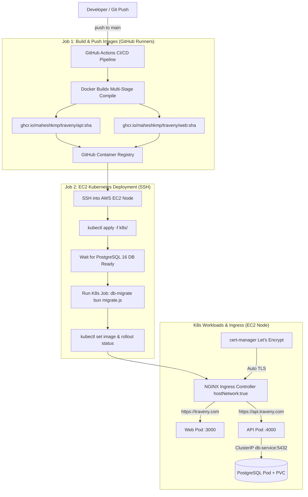

# 🚀 Traveny: Enterprise Production Kubernetes & Cloud Architecture

[](https://aws.amazon.com/)
[](https://kubernetes.io/)
[](https://www.terraform.io/)
[](https://github.com/features/actions)
[](https://prometheus.io/)
[](https://bun.sh/)
[](https://nextjs.org/)
[](https://hono.dev/)

Welcome to **Traveny**, an enterprise-grade monorepo SaaS platform built with **Next.js 15**, **Hono API**, and **Drizzle ORM**, paired with a **complete Cloud Platform Engineering pipeline**. 

This repository demonstrates a 100% automated, production-ready DevOps infrastructure featuring **Terraform IaC**, **Self-Managed AWS EC2 Kubernetes (`kubeadm`)**, **NGINX Ingress with Automated Let's Encrypt TLS (`cert-manager`)**, **Automated K8s DB Migrations**, **GHCR Container Registry CI/CD**, and full-stack **Observability (Prometheus & Grafana)**.

---

## 🏛️ End-to-End System Architecture

```
+---------------------------------------------------------------------------------------------------+
|                                            AWS Cloud                                              |
|                                                                                                   |
|  +---------------------------------------------------------------------------------------------+  |
|  |                        VPC: traveny-k8s-vpc (10.0.0.0/16)                                  |  |
|  |                                                                                             |  |
|  |  +---------------------------------------------------------------------------------------+  |  |
|  |  |               Public Subnet: traveny-k8s-subnet (10.0.1.0/24)                         |  |  |
|  |  |                                                                                       |  |  |
|  |  |   +-------------------------------------------------------------------------------+   |  |  |
|  |  |   |                Security Group: traveny-k8s-sg                                 |   |  |  |
|  |  |   |                                                                               |   |  |  |
|  |  |   |   +-----------------------------------------------------------------------+   |   |  |  |
|  |  |   |   |        AWS Elastic IP (Static) ===> EC2 Instance (t3.small)          |   |   |  |  |
|  |  |   |   |        - OS: Ubuntu 24.04 LTS (Noble Numbat)                          |   |   |  |  |
|  |  |   |   |        - K8s Control Plane: kubeadm v1.30                             |   |   |  |  |
|  |  |   |   |        - Runtime: containerd.io (SystemdCgroup = true)                |   |   |  |  |
|  |  |   |   |        - CNI Plugin: Flannel Network Plugin (10.244.0.0/16)            |   |   |  |  |
|  |  |   |   |        - Storage Class: Rancher Local-Path Persistent Storage (30GB)  |   |   |  |  |
|  |  |   |   +-----------------------------------------------------------------------+   |   |  |  |
|  |  |   |        ▲ SSH (22)  ▲ HTTP (80)  ▲ HTTPS (443)  ▲ K8s API (6443)              |   |  |  |
|  |  |   +--------|-----------|------------|-------------|-------------------------------+   |  |  |
|  |  +------------|-----------|------------|-------------|-----------------------------------+  |  |
|  |               |           |            |             |                                      |  |
|  |               |           ▼            ▼             |                                      |  |
|  |  +------------|--------------------------------------|-----------------------------------+  |  |
|  |  | Route Table| traveny-public-rt                        |                                   |  |  |
|  |  | Destination| 0.0.0.0/0 ---> Internet Gateway         |                                   |  |  |
|  |  +------------|--------------------------------------|-----------------------------------+  |  |
|  |               |                                      |                                      |  |
|  |               ▼                                      ▼                                      |  |
|  |  +---------------------------------------------------------------------------------------+  |  |
|  |  | Internet Gateway: traveny-k8s-igw                                                     |  |  |
|  |  +---------------------------------------------------------------------------------------+  |  |
|  +-----------------------------------|---------------------------------------------------------+  |
+--------------------------------------|------------------------------------------------------------+
                                       │
                                       │ Public Internet Traffic
                                       ▼
                        +------------------------------+
                        |   Browser / Client Requests  |
                        |   - https://traveny.com      |
                        |   - https://api.traveny.com  |
                        +------------------------------+
```

---

## ⚡ Automated CI/CD & Deployment Pipeline (Mermaid Diagram)



---

## 🛠️ Technology Stack & Core Architecture

| Domain | Technologies | Details & Rationale |
| :--- | :--- | :--- |
| **Workspace & Runtime** | [Bun v1.0+](https://bun.sh/) | Workspaces monorepo, fast dependency resolution, and lightning-fast TypeScript bundling. |
| **Frontend Application** | Next.js 15 (App Router) | Standalone server build (`.next/standalone`), dynamic server-side API loopback proxying. |
| **Backend API Service** | Hono Framework | High-performance API runtime, Zod OpenAPI validation, and RPC type bindings. |
| **Auth & Data Persistence** | Better Auth + Drizzle ORM | Monorepo shared core package (`packages/core`), PostgreSQL 16 with versioned SQL migrations. |
| **Infrastructure as Code** | Terraform (~> 6.0) | AWS VPC, Public Subnets, Security Groups, Elastic IP (EIP), and automated `user_data` bootstrapper. |
| **Container Orchestration** | Kubernetes (`kubeadm` v1.30) | Single-node production control plane, containerd (`SystemdCgroup`), Flannel CNI, and Rancher local-path storage. |
| **Ingress & TLS Security** | NGINX Ingress + `cert-manager` | Automated Let's Encrypt SSL/TLS certificates with zero manual intervention. |
| **CI/CD Pipeline** | GitHub Actions + GHCR | Multi-stage Docker builds, layer caching (`type=gha`), automated K8s migration jobs, zero-downtime rollouts. |
| **Observability & Metrics** | Prometheus + Grafana | Helm `kube-prometheus-stack` monitoring Node, Container, K8s cluster, and custom API metrics. |

---

## 📂 Repository Structure

```text
traveny/
├── apps/
│   ├── api/                     # Hono Backend API Service
│   │   ├── src/                 # Routes, Middlewares, OpenAPI configuration
│   │   └── Dockerfile           # Optimized multi-stage Docker build (bundling server.js & migrate.js)
│   └── web/                     # Next.js 15 Frontend Web Application
│       ├── src/                 # App Router pages, Components, Auth proxy
│       └── Dockerfile           # Multi-stage standalone Next.js build
│
├── packages/
│   └── core/                    # Shared workspace library
│       └── src/
│           ├── auth/            # Better Auth configuration & hooks
│           └── database/        # Drizzle ORM schema & versioned SQL migrations
│
├── k8s/                         # Declarative Kubernetes Manifests
│   ├── namespace.yaml           # Dedicated `traveny` namespace definition
│   ├── secrets.yaml             # DB credentials & application secret keys
│   ├── db.yaml                  # PostgreSQL 16 Deployment + PersistentVolumeClaim (PVC)
│   ├── api.yaml                 # Hono API Deployment + Service + imagePullSecrets
│   ├── web.yaml                 # Next.js Web Deployment + Service + imagePullSecrets
│   ├── ingress.yaml             # NGINX Ingress rules & TLS configuration
│   ├── cluster-issuer.yaml      # cert-manager Let's Encrypt Production Issuer
│   └── migration-job.yaml       # K8s Job executing `bun migrate.js` before container rollouts
│
├── terraform/                   # Infrastructure as Code (IaC)
│   ├── main.tf                  # AWS VPC, Subnet, Security Group, EIP, EC2 Instance
│   ├── variables.tf             # Region, Instance Type (t3.small), Dynamic IP CIDR logic
│   ├── outputs.tf               # Exported Elastic IP and ssh/kubeadm commands
│   ├── dev.tfvars               # Local deployment variables (GitIgnored)
│   ├── example.tfvars           # Template variable file for version control
│   └── scripts/
│       └── user_data.sh         # 100% Zero-Touch Bootstrapper (Installs K8s, CNI, Ingress & App)
│
├── .github/
│   └── workflows/
│       └── deploy.yml           # Automated CI/CD Pipeline (Build -> Push GHCR -> Migrate -> Rollout)
├── .dockerignore                # Excludes non-app directories (terraform, k8s, docs) from Docker builds
├── .gitignore                   # Excludes secrets, terraform state, and node_modules
└── README.md                    # System architecture documentation
```

---

## ☁️ Infrastructure as Code (Terraform)

The `terraform/` directory contains a 100% zero-touch infrastructure provisioner.

### 1. Provisioning AWS Infrastructure
```bash
cd terraform

# Initialize Terraform plugins
terraform init

# Review execution plan
terraform plan -var-file="dev.tfvars"

# Provision entire AWS cloud infrastructure
terraform apply -var-file="dev.tfvars"
```

### 2. Zero-Touch Bootstrapping (`user_data.sh`)
When the EC2 instance boots up, `user_data.sh` automatically:
1. Configures 2GB Swap space & kernel networking modules (`overlay`, `br_netfilter`, `ip_forward`).
2. Installs `containerd` with `SystemdCgroup = true`.
3. Installs `kubeadm`, `kubelet`, and `kubectl` (v1.30).
4. Initializes Kubernetes control plane (`kubeadm init`) with static Elastic IP SANs.
5. Untaints control plane node and installs Flannel CNI & Rancher local-path storage provisioner.
6. Installs NGINX Ingress Controller with `hostNetwork: true`.
7. Clones the repository and deploys default application manifests.

### 3. Tearing Down Infrastructure
```bash
terraform destroy -var-file="dev.tfvars"
```

---

## ☸️ Kubernetes Cluster & Workload Management

### One-Time Secret Setup on EC2
SSH into your EC2 instance (`ssh -i ~/.ssh/terraform-key ubuntu@<ELASTIC_IP>`) and run:

```bash
# Create namespace
kubectl create namespace traveny

# Create GHCR registry secret for pulling private images
kubectl create secret docker-registry regcred \
  --docker-server=ghcr.io \
  --docker-username=maheshkmp \
  --docker-password=<YOUR_GITHUB_PAT> \
  -n traveny

# Create production secrets
kubectl create secret generic traveny-secrets \
  --from-literal=postgres-user=<YOUR_DB_USER> \
  --from-literal=postgres-password=<YOUR_DB_PASSWORD> \
  --from-literal=postgres-db=<YOUR_DB_NAME> \
  --from-literal=better-auth-secret=<YOUR_AUTH_SECRET> \
  --from-literal=resend-api-key=<YOUR_RESEND_API_KEY> \
  --from-literal=database-url="postgresql://<YOUR_DB_USER>:<YOUR_DB_PASSWORD>@db-service:5432/<YOUR_DB_NAME>" \
  -n traveny
```

### Checking Pods & Ingress Routing
```bash
# View active pods in traveny namespace
kubectl get pods -n traveny

# View services and ingress rules
kubectl get svc,ingress -n traveny

# Watch live API logs
kubectl logs -n traveny deployment/api -f
```

---

## 🔒 Automated Let's Encrypt HTTPS / SSL (`cert-manager`)

Traveny automates SSL certificate management through `cert-manager`:

1. **`cert-manager` Installation:** Installed automatically during initial deployment.
2. **ACME HTTP-01 Challenge:** Let's Encrypt verifies ownership of `traveny.com` and `api.traveny.com` over HTTP port 80.
3. **Secret Storage:** Issued TLS certificates are stored in Kubernetes secret `traveny-tls`.
4. **Auto-Renewal:** Certificates are automatically renewed every 60 days without downtime.

---

## 📊 Observability & Monitoring (Prometheus & Grafana)

Full cluster health, CPU/Memory metrics, and network activity are monitored via Helm:

```bash
# Install Prometheus + Grafana into the 'monitoring' namespace
helm repo add prometheus-community https://prometheus-community.github.io/helm-charts
helm repo update
helm install prometheus prometheus-community/kube-prometheus-stack --namespace monitoring --create-namespace

# Get Grafana admin password
kubectl get secret -n monitoring prometheus-grafana -o jsonpath="{.data.admin-password}" | base64 --decode ; echo

# Access Grafana Dashboard via Port Forward
kubectl port-forward -n monitoring svc/prometheus-grafana 3001:80
```
Open **`http://localhost:3001`** (User: `admin`) to view real-time Kubernetes dashboards!

---

## 📜 License
This project is open-source and available under the [MIT License](LICENSE).
